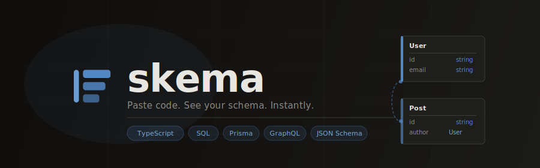
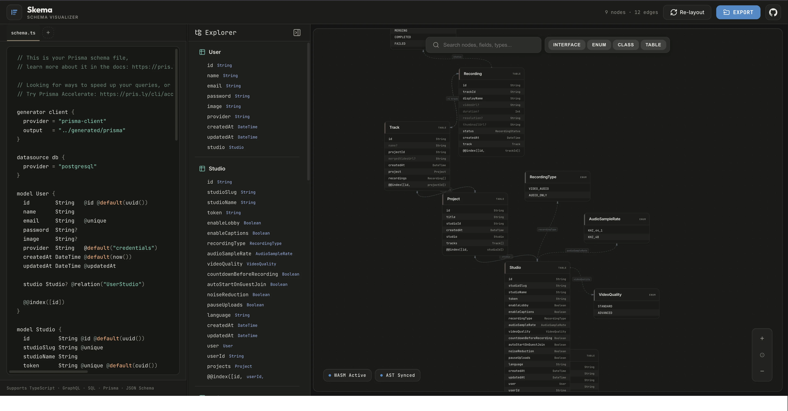

<div align="center">



<br/>

[](https://www.rust-lang.org/)
[](https://react.dev/)
[](https://www.typescriptlang.org/)

**Skema** is a blazing-fast, language-agnostic schema visualizer.  
Paste raw code \- TypeScript, SQL, Prisma, GraphQL, JSON Schema \- and instantly get  
an interactive, draggable entity-relationship diagram, all running at native speed in your browser.

</div>

<div align="center">



</div>

---

## What is Skema?

Most schema tools are either too slow, locked to one language, or require a server. Skema is different:

- The **parsing engine is written in Rust** and compiled to WebAssembly \- it runs at near-native speed directly in the browser with no backend, no API calls, no latency.
- It supports **five schema languages out of the box** and auto-detects the format.
- The **canvas is built on custom SVG** \- no third-party graph library \- giving full control over rendering, animations, and layout.

---

## Features

|                                                                                                | Feature                  | Description                                                                          |
| ---------------------------------------------------------------------------------------------- | ------------------------ | ------------------------------------------------------------------------------------ |
|               | **Live Parsing**         | Diagram updates as you type, debounced to keep it smooth                             |
|               | **WASM-Powered Core**    | Rust parser compiled to WebAssembly - industry-grade AST crates (`swc`, `sqlparser`) |
|   | **Interactive Canvas**   | Pan, zoom, drag nodes; layout persists to `localStorage`                             |
|  | **Smart Auto-Layout**    | Kind-based grouping + force-directed spring physics for readable graphs              |
|            | **Search & Filter**      | Global search, kind filter chips, relationship toggles                               |
|            | **Multi-Tab Support**    | Open multiple schema files simultaneously                                            |
|            | **Export**               | Download as SVG, PNG, or raw JSON; copy a shareable URL                              |
|  | **Node Detail Drawer**   | Click any node to see full fields, modifiers, and linked edges                       |
|        | **Method Tree Explorer** | Collapsible sidebar with class/method hierarchy                                      |
|              | **Shareable URLs**       | Entire schema encoded in the URL hash - share a link, anyone opens the same diagram  |

---

## Supported Languages

| Language                  | Parser                 | What is extracted                                                                            |
| ------------------------- | ---------------------- | -------------------------------------------------------------------------------------------- |
| **TypeScript / JS**       | SWC AST                | Interfaces, classes, types, enums \- generics, optionals, arrays, unions, extends/implements |
| **SQL**                   | `sqlparser` crate      | `CREATE TABLE` columns, types, `PRIMARY KEY`, `FOREIGN KEY` constraints                      |
| **Prisma**                | Regex-based            | Models, enums, field types, optional (`?`) and list (`[]`) modifiers                         |
| **GraphQL**               | `graphql-parser` crate | Types, inputs, interfaces, enums, unions, scalars, `implements`                              |
| **JSON Schema / OpenAPI** | Custom                 | `definitions`, `$ref` resolution, `required` fields, nested objects                          |

Format is auto-detected from heuristics \- you rarely need to specify it manually.

---

## Tech Stack

### `core/` \- Rust Parsing Engine

|                       |                                           |
| --------------------- | ----------------------------------------- |
| **Language**          | Rust (Edition 2024)                       |
| **Target**            | WebAssembly (`wasm-pack`, `wasm-bindgen`) |
| **TypeScript / JS**   | `swc_ecma_parser` v39 \- full AST         |
| **SQL**               | `sqlparser` v0.62                         |
| **GraphQL**           | `graphql-parser` v0.4                     |
| **Serialization**     | `serde` + `serde-wasm-bindgen`            |
| **Pattern detection** | `regex` v1.12                             |

### `web/` \- React Frontend

|                 |                                         |
| --------------- | --------------------------------------- |
| **Framework**   | React 19 + Vite 8                       |
| **Language**    | TypeScript 6                            |
| **Code Editor** | CodeMirror v6 (custom Skema dark theme) |
| **Canvas**      | Custom SVG renderer (no graph library)  |
| **Icons**       | Lucide React                            |
| **Export**      | `html-to-image` (PNG/SVG)               |
| **Styling**     | Vanilla CSS, dark theme, glassmorphism  |
| **Fonts**       | Inter, JetBrains Mono, Outfit           |

---

## Project Structure

```
skema/
├── assets/                  # Project assets (logo, banner, favicon)
│   ├── logo.svg
│   ├── favicon.svg
│   └── banner.svg
│
├── core/                    # Rust + WebAssembly parsing engine
│   ├── Cargo.toml
│   └── src/
│       ├── lib.rs           # WASM entry point \- exports parse_schema_wasm()
│       ├── schema.rs        # Core types: SchemaNode, SchemaEdge, ParsedSchema
│       └── parsers/
│           ├── mod.rs       # Format detection + router
│           ├── typescript.rs
│           ├── sql.rs
│           ├── prisma.rs
│           ├── graphql.rs
│           ├── json_schema.rs
│           └── enums.rs
│
└── web/                     # React frontend
    ├── package.json
    ├── vite.config.ts
    ├── index.html
    └── src/
        ├── App.tsx          # Root state, WASM init, tabs, export, share
        ├── types.ts         # TypeScript types mirroring Rust schema
        ├── index.css        # CSS variables, dark theme tokens
        ├── components/
        │   ├── Canvas.tsx           # SVG canvas \- pan/zoom, edge paths, node drag
        │   ├── NodeCard.tsx         # Visual card per node (kind stripe, field rows)
        │   ├── Editor.tsx           # CodeMirror wrapper
        │   ├── MethodTree.tsx       # Collapsible class/method explorer sidebar
        │   └── NodeDetailDrawer.tsx # Side panel \- fields, modifiers, edge navigation
        ├── editor/
        │   ├── languageFromFileName.ts   # Syntax detection per file extension
        │   └── skemaCodemirrorTheme.ts   # Custom editor theme
        ├── utils/
        │   └── layout.ts    # Force-directed physics layout engine
        └── core_pkg/        # Generated WASM bindings (built from core/)
```

### What lives where

**`core/`** is a pure Rust library. It has no UI, no HTTP server. It exposes a single public function:

```rust
#[wasm_bindgen]
pub fn parse_schema_wasm(input: &str) -> JsValue { ... }
```

It auto-detects the schema format, runs the appropriate parser, and returns a `ParsedSchema` (nodes + edges) serialized to JSON for JavaScript to consume.

**`web/`** is the entire UI. It:

1. Initialises the WASM module on load
2. Passes editor content into `parse_schema_wasm()` on each keystroke (debounced)
3. Receives the `ParsedSchema` and runs the layout engine (`layout.ts`)
4. Renders nodes and edges onto an SVG canvas (`Canvas.tsx`)
5. Handles user interaction: pan/zoom, drag, selection, detail drawer, export

---

## Getting Started

### Prerequisites

- **Node.js** v18+
- **Rust** (stable) - [rustup.rs](https://rustup.rs)
- **wasm-pack** - `cargo install wasm-pack`

### One command

```bash
cd core && wasm-pack build --target web --out-dir ../web/src/core_pkg && cd ../web && npm install && npm run dev
```

Open [http://localhost:5173](http://localhost:5173).

### Step by step

**1. Build the WASM core**

```bash
cd core
wasm-pack build --target web --out-dir ../web/src/core_pkg
```

**2. Run the frontend**

```bash
cd web
npm install
npm run dev
```

**3. Production build**

```bash
cd web
npm run build
# Output: web/dist/
```

---

## Architecture Notes

### Why Rust + WASM?

Schema parsing is non-trivial. TypeScript in particular requires a full AST parser. By using Rust with SWC (the same parser powering many production bundlers), Skema gets correct, fast parsing that handles real-world TypeScript syntax \- generics, intersections, conditional types \- without shipping a 5 MB JavaScript parser bundle.

### Why a custom SVG canvas?

Third-party graph libraries (D3-force, Cytoscape, etc.) add significant bundle size and make styling difficult. A custom SVG renderer gives full control over node appearance, edge routing, animations, and interaction \- and keeps the bundle lean.

### Layout Algorithm

`layout.ts` runs in two phases:

1. **Static placement** \- nodes are grouped by kind (tables, interfaces, classes, enums, scalars, methods) into columns. Within each column, higher-degree nodes (more connections) are placed first.
2. **Force simulation** \- a spring-physics pass runs on first load to pull connected nodes closer and push unrelated nodes apart, settling into a readable graph.

Manually dragged nodes are "pinned" and excluded from future auto-layout passes.

---

## Data Model

The Rust core produces a `ParsedSchema`:

```ts
interface ParsedSchema {
  nodes: SchemaNode[];
  edges: SchemaEdge[];
}

interface SchemaNode {
  id: string;
  displayName: string;
  kind: "Interface" | "Class" | "Enum" | "Table" | "Method" | "Scalar";
  fields: SchemaField[];
  format:
    | "TypeScript"
    | "GraphQL"
    | "Sql"
    | "Prisma"
    | "JsonSchema"
    | "Unknown";
}

interface SchemaEdge {
  sourceNodeId: string;
  targetNodeId: string;
  kind:
    | "Extends"
    | "Implements"
    | "References"
    | "Returns"
    | "has-field"
    | "foreign-key";
  label?: string;
}

interface SchemaField {
  name: string;
  fieldType: string;
  modifiers: ("Optional" | "Nullable" | "Array" | "Readonly")[];
}
```

---
